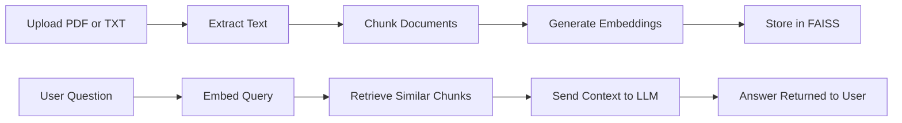

# AI Document Assistant (RAG System)

AI Document Assistant is a fullstack application that enables users to interact with their documents using natural language.

It allows uploading PDFs or text files and asking questions about their content, returning accurate, context-aware answers powered by Retrieval-Augmented Generation (RAG).

## Current Implementation Status

- Backend pipeline is implemented and tested.
- Embeddings are working, but they are currently deterministic hash-based vectors rather than a semantic model.
- Vector storage is working and backed by FAISS with disk persistence.
- LLM answering is wired through Ollama with a mock fallback.
- Frontend is planned, but it is not yet checked into this repository.

This type of system is commonly used in:
- internal knowledge bases
- technical documentation search
- customer support automation
- contract and policy analysis

The project demonstrates how modern AI systems can turn static documents into interactive knowledge tools.

## Demo / Screenshots

> Add screenshots or a short demo video here.

### Main UI


### Document Upload Flow


### Question Answering Result


## Features

- Upload PDF and TXT documents through a clean web interface
- Extract and chunk document content for downstream retrieval
- Generate embeddings for semantic search via a pluggable embedding layer
- Store vectors in FAISS for fast similarity lookup
- Ask questions in natural language and receive grounded answers
- Return source-aware responses based on retrieved context
- Support a planned lightweight React frontend and a FastAPI backend
- Designed with scalability in mind to multiple users and larger document collections

## Real-World Context

This project is inspired by real-world engineering workflows where large volumes of technical documentation, logs, or internal knowledge must be quickly accessible.

With a background in industrial systems and data processing, the architecture reflects practical constraints:
- handling semi-structured data
- building responsive interfaces for configuration and analysis
- integrating backend processing with user-facing tools

In practice, this approach reduces hallucinations and ensures that answers remain grounded in the source material.

## Architecture Overview

This project uses a standard RAG pipeline:

1. The user uploads a document.
2. The backend extracts text from the file.
3. The text is split into smaller chunks.
4. Each chunk is converted into embeddings.
5. Embeddings are stored in a vector database.
6. When the user asks a question, the query is embedded as well.
7. The system retrieves the most relevant chunks from the vector store.
8. The retrieved context is sent to an LLM.
9. The LLM generates a response grounded in the uploaded document.

In practice, this reduces hallucinations and keeps answers tied to the source material.

### RAG Flow



## Tech Stack

### Backend
- Python
- FastAPI
- Uvicorn
- Pydantic
- FAISS

### Frontend (planned)
- React
- HTML/CSS
- Fetch API or Axios

### AI and Search
- Ollama or hosted LLM API for answer generation
- Deterministic embedding service today, easy to swap for sentence-transformers or OpenAI later
- FAISS for vector similarity search

### Document Processing
- PDF parsing library
- Text extraction utilities
- Chunking and preprocessing logic

## Project Structure

```text
ai-document-assistant/
├── backend/
│   ├── app/
│   │   ├── api/
│   │   │   ├── routes/
│   │   │   │   ├── health.py
│   │   │   │   ├── documents.py
│   │   │   │   └── chat.py
│   │   │   └── router.py
│   │   ├── core/
│   │   │   ├── config.py
│   │   │   └── dependencies.py
│   │   ├── services/
│   │   │   ├── document_service.py
│   │   │   ├── embedding_service.py
│   │   │   ├── vector_store.py
│   │   │   ├── llm_service.py
│   │   │   └── rag_service.py
│   │   ├── models/
│   │   │   ├── document.py
│   │   │   └── chat.py
│   │   ├── utils/
│   │   │   ├── chunking.py
│   │   │   └── file_loader.py
│   │   └── main.py
│   ├── data/
│   │   ├── uploads/
│   │   ├── index/
│   │   └── metadata/
│   ├── tests/
│   ├── pyproject.toml
│   ├── uv.lock
│   ├── README.md
│   └── .env.example
├── docs/
│   ├── backend-roadmap.md
│   └── testing-strategy.md
├── README.md
└── .gitignore
```

## Installation

### Prerequisites

- Python 3.10+
- Optional: Ollama installed locally if using a local LLM
- Optional: Node.js 18+ for the future frontend when it is added

### 1. Clone the repository

```bash
git clone https://github.com/your-username/ai-document-assistant.git
cd ai-document-assistant
```

### 2. Set up the backend

```bash
cd backend
uv sync
```

### 3. Configure environment variables

Create a `.env` file in the `backend/` directory:

```env
APP_NAME=AI Document Assistant
ENVIRONMENT=development
API_HOST=0.0.0.0
API_PORT=8000

# Embeddings
EMBEDDING_MODEL=sentence-transformers/all-MiniLM-L6-v2

# LLM
LLM_PROVIDER=ollama
OLLAMA_BASE_URL=http://127.0.0.1:11434
OLLAMA_MODEL=qwen2.5:1.5b
OLLAMA_KEEP_ALIVE=1h
LLM_TEMPERATURE=0.2
LLM_TIMEOUT=60

# Vector store
VECTOR_STORE=faiss
INDEX_PATH=./data/index
UPLOAD_DIR=./data/uploads
METADATA_DIR=./data/metadata
```

If you use a hosted LLM or embeddings API, replace these values with your provider credentials.

## Usage

### Start the backend

From the `backend/` directory:

```bash
uv run uvicorn app.main:app --reload --host 0.0.0.0 --port 8000
```

The API will be available at:

```text
http://localhost:8000
```

API documentation will be available at:

```text
http://localhost:8000/docs
```

### Typical workflow

1. Start the backend.
2. Upload a PDF or TXT document through the API or the inspection CLI.
3. Wait for the system to process and index the file.
4. Ask a question with `/api/chat/ask`.
5. Receive an answer grounded in the uploaded content.

## API Endpoints

The backend follows a standard FastAPI structure.

### Health Check

```http
GET /health
```

#### Response

```json
{
  "status": "ok",
  "service": "AI Document Assistant"
}
```

### Upload Document

```http
POST /api/documents/upload
```

#### Request
- Content-Type: `multipart/form-data`
- Field: `file`

#### Response

```json
{
  "document_id": "doc_12345",
  "filename": "employee-handbook.pdf",
  "status": "processed",
  "uploaded_at": "2026-04-06T10:15:00Z",
  "chunks_created": 24,
  "embedding_model": "sentence-transformers/all-MiniLM-L6-v2"
}
```

### List Documents

```http
GET /api/documents
```

#### Response

```json
{
  "documents": [
    {
      "document_id": "doc_12345",
      "filename": "employee-handbook.pdf",
      "status": "processed",
      "uploaded_at": "2026-04-06T10:15:00Z",
      "chunks_created": 24,
      "embedding_model": "sentence-transformers/all-MiniLM-L6-v2"
    }
  ]
}
```

### Ask Question

```http
POST /api/chat/ask
```

#### Request

```json
{
  "question": "What is the remote work policy?",
  "document_id": "doc_12345"
}
```

#### Response

```json
{
  "question": "What is the remote work policy?",
  "answer": "Employees may work remotely up to three days per week, subject to manager approval.",
  "sources": [
    {
      "chunk_id": "chunk_7",
      "page": 4,
      "score": 0.91
    }
  ]
}
```

### Get Document Status

```http
GET /api/documents/{document_id}
```

#### Response

```json
{
  "document_id": "doc_12345",
  "filename": "employee-handbook.pdf",
  "status": "processed",
  "uploaded_at": "2026-04-06T10:15:00Z",
  "chunks_created": 24,
  "embedding_model": "sentence-transformers/all-MiniLM-L6-v2",
  "content_type": "application/pdf"
}
```

## Example Workflow

1. A user uploads a contract in PDF format.
2. The backend extracts the text and splits it into chunks.
3. Each chunk is embedded and stored in FAISS.
4. The user asks, “What are the payment terms?”
5. The system searches for the most relevant chunks.
6. The retrieved context is passed to the LLM.
7. The app returns a concise answer with supporting context.

This flow makes the application useful for contract review, policy search, onboarding docs, and knowledge base retrieval.

## Future Improvements

- Add user authentication and per-user document isolation
- Support DOCX and additional file types
- Add document deletion and re-indexing
- Store metadata and chat history in a database
- Add citation highlighting in the UI
- Support streaming responses from the LLM
- Add OCR for scanned PDFs
- Introduce multi-document querying across collections
- Replace local storage with cloud object storage for production
- Add background workers for large file processing
- Support scalable deployment with Docker and orchestration

## Why This Project Matters

This project solves a practical business problem: turning static documents into a searchable, conversational knowledge system.

For clients, that means:
- faster access to information
- reduced time spent searching through PDFs and policy files
- fewer repetitive support questions
- better internal productivity
- a foundation for customer-facing or internal AI tools

For recruiters, it demonstrates:
- fullstack engineering ability
- API design with FastAPI
- frontend integration with React
- practical AI system design
- retrieval-based LLM architecture
- attention to production-ready product structure

For a portfolio, it shows more than a demo. It shows a system with clear business value and a realistic path to production.
Additionally, it reflects the ability to bridge engineering domains with modern AI tools, combining backend development, data processing, and user interface design.
## License

TODO: Add your preferred license here.

## Contact

TODO: 